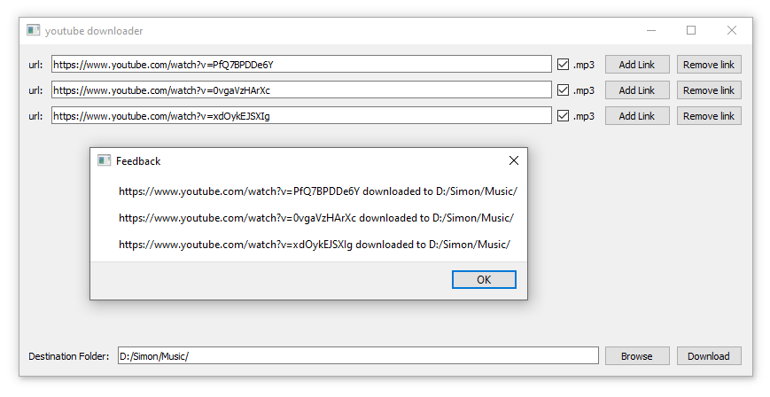

# youtube-downloader
The objective of this desktop application is to download youtube videos as well as youtube playlists.  
  
downloader.py is a proof of concept.  
d_gui.py is a more sophisticated version, with a clean GUI (see screenshot)   
  
I have made a nice GUI that lets users add urls, select a destination location and hit download.  
There is also a possibility to download mp3 files rather than mp4.

To get this to work properly, I had to dive in and make some changes to the pytube library.  
I repeatedly got the following error "urllib.error.HTTPError: HTTP Error 403: Forbidden".  
Using the suggestions from this forum : https://github.com/nficano/pytube/issues/399 I was able to resolve the problem.  

